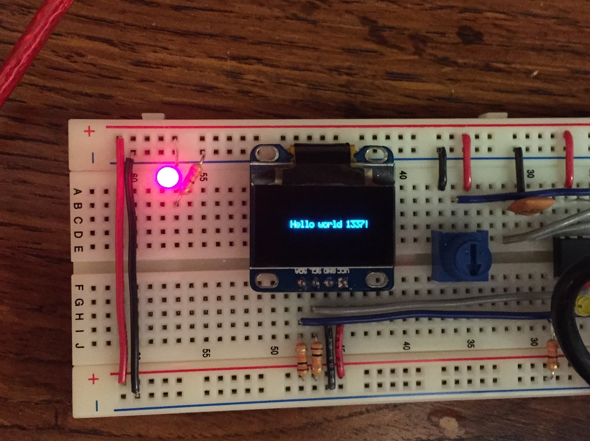

Advanced Mechatronics
=============================================

Josh Marino 
---------------------------------------------

#### Table of Contents ####
1. [Homework #1](#hw1)
2. [Homework #2](#hw2)
3. [Homework #3](#hw3)
4. [Homework #4](#hw4)

#### Homework #1 
The first homework assignment included wiring the PIC32 with 2 LEDS, 2 push buttons, and a potentiometer. Code had to be written for the following tasks:

1. Toggle LED1 every 1/2 second
2. When USER is pushed, toggle LED1 as fast as possible
3. Set LED2 brightness proportional to the potentiometer voltage
4. Set LED2 frequency to 1kHz using Timer 2 and verify with the nScope or Tek scope

#### Homework #2 
Our second homework assignment involved created an EAGLE schematic for our protoboard. New devices had to be created for the following:

1. PIC32MX250F128B (Digikey ED3026-ND)
2. 8MHz resonator (Digikey X905-ND)
3. 2-lead push button (Digikey P8072SCT-ND)

Last, the chips were added to the schematic, and components were connected together with electrical connections.

#### Homework #3 
The third homework assignment created a board layout from the EAGLE schematic for our protoboard. After the components were placed, connections were added for wires. Once everything was wired and connected, gerber files were generated and double-checked using mayhewlabs 3d gerber viewer.

#### Homework #4 
The fourth homework assignment was interfacing with the (SSD1306 128x64 I2C OLED display)[https://www.adafruit.com/products/326]. We had to write code for a driver that would show text on the display screen. This was primarily done using display_pixel_set() and draw_display() in which each pixel was set to either 0 or 1, and only appeared on the display after calling draw_display().

